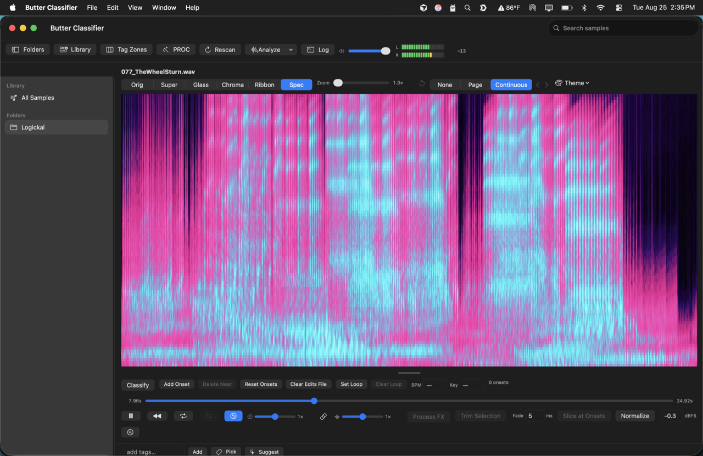
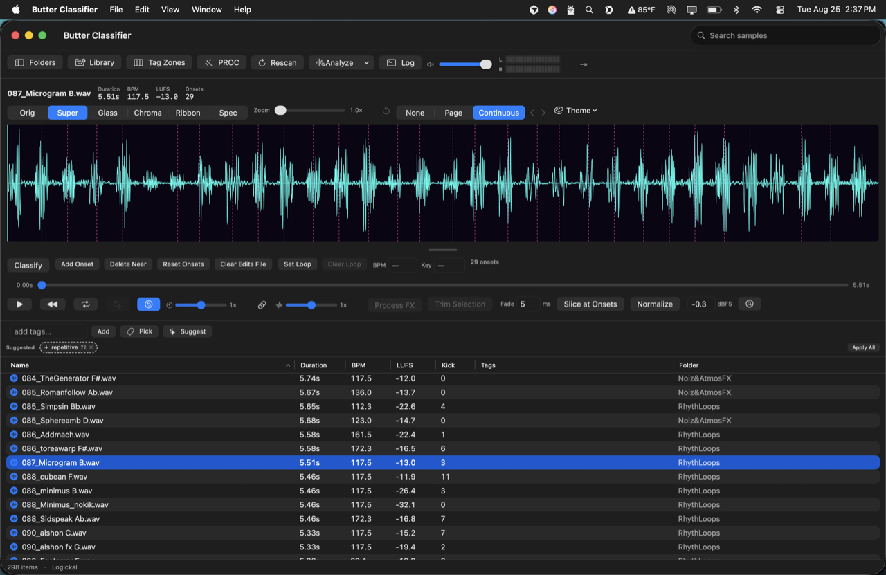
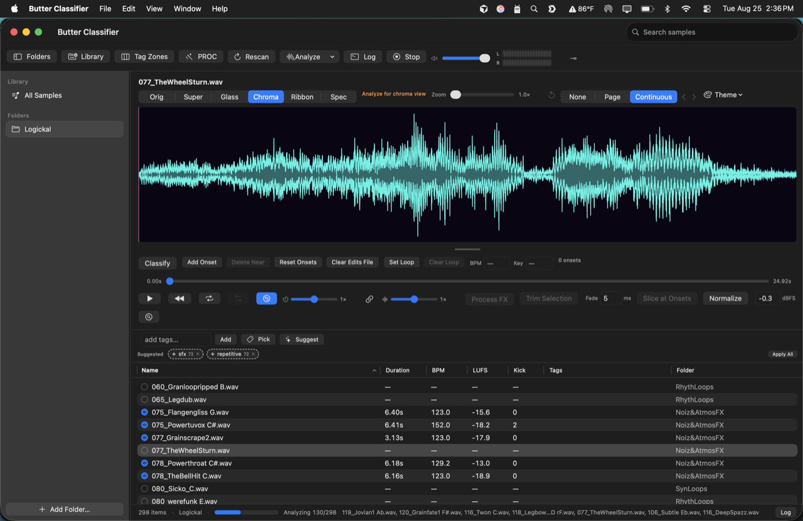
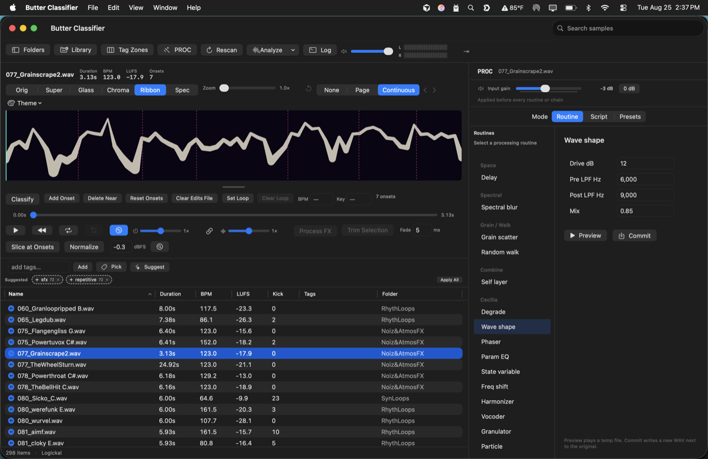
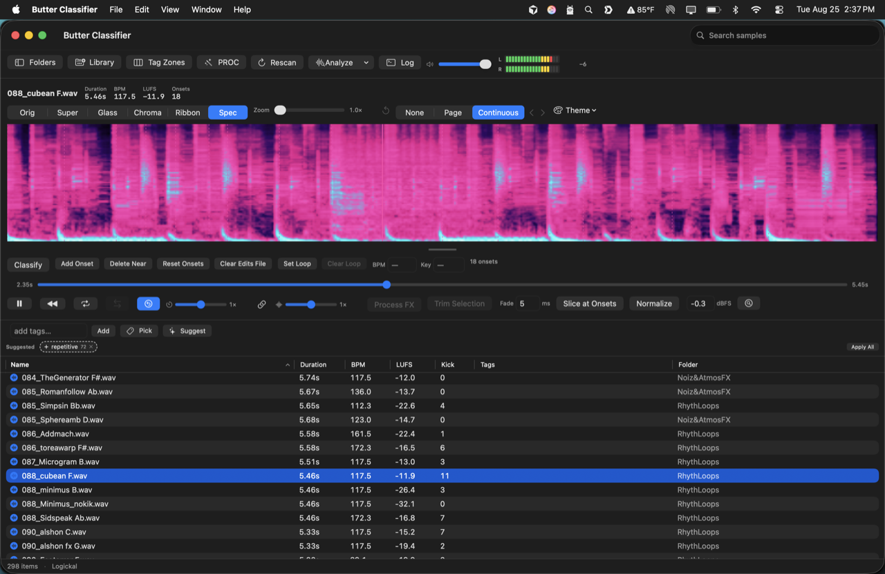
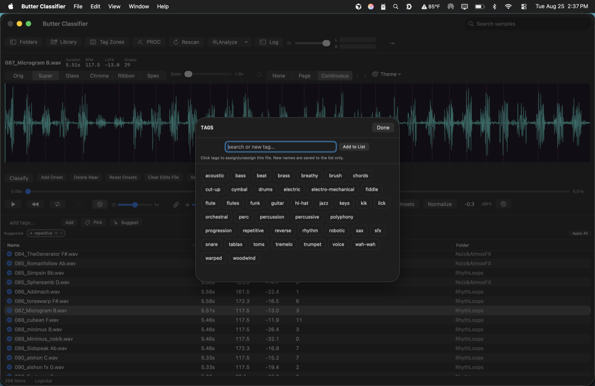

# Butter Classifier

A native macOS app for managing, analyzing, and editing audio loops and samples. The analysis engine is the original `audio_analyzer.py` (in `A.Milburn Original Script/`), which extracts tempo, onsets, swing, loudness, spectral features, and more, writing a `.yaml` sidecar next to each audio file.

The built app is fully self-contained: a relocatable Python runtime (with librosa, essentia, scipy, etc.) is bundled inside `ButterClassifier.app`, so end users just launch the app — no Python, Homebrew, or setup required.

## Screenshots

| Mel spectrogram (Spec view) | Super waveform + onsets |
|---|---|
|  |  |

| Library browser + batch analyze | PROC effects panel |
|---|---|
|  |  |

| Classify mode + metadata | Tag picker |
|---|---|
|  |  |

## Features

- **Tags**: read/write `sample.wav_tags.yaml` sidecars (LUP/gold_snds format). Edit tags in the detail pane.
- **Tag Zones**: global preset editor (LUP lobby clone) — vertical depth bands, OR'd tags, axis windows. Toolbar → Tag Zones.
- **Library finder**: LUP-style sample browser with glyph canvas, tag filters, axis pickers, play/select. Toolbar → Library.
- **Analysis**: run the analyzer on a file, folder, or the whole library, with live progress and a full output log. Files that already have a `.yaml` are skipped; re-analyze deletes the stale sidecar first. Optional BPM override.
  - Analysis runs on a pool of persistent Python workers: each worker pays the heavy librosa/essentia import cost (~1 min) once per app session, then analyzes files in a few seconds each. The first worker warms up in the background at app launch.
  - "Files in Parallel" in the Analyze menu defaults to a safe maximum for your machine. On Macs with 32 GB+ RAM this allows up to 2× your core count (workers often wait on disk I/O). Each worker uses roughly 600–800 MB once warm; the cap also respects available RAM.
  - If the app is run from a cloud-synced folder (iCloud/Synology/Dropbox under `~/Library/CloudStorage`), the analyzer runtime is mirrored once into `~/Library/Application Support/ButterClassifier/` and run from there — memory-mapped native libraries served by file providers intermittently segfault otherwise.
- **Player**: waveform with analyzed onset markers, click-to-seek, loop playback.
- **PROC**: 16 routines in 7 groups (gain, filters, limiter, gate, clip, crush, tremolo, fade, delay, stutter, …). Script chains + 6 LUP preset chains. Toolbar → PROC.
- **Classification editor**: Classify mode — drag onsets, draw loop braces on the waveform, override BPM/key. ⌘Z undoes onsets, loop, BPM, and key. Saves to `sample.wav_edits.yaml` (indexed in the library table). Re-analyze uses per-file BPM override from edits when the toolbar override is blank.
- **Editing** (non-destructive — always writes new files):
  - Trim: drag a selection on the waveform, export it (with anti-click fades).
  - Slice at onsets: cut the file into per-onset WAVs in a `<name>_slices` folder.
  - Normalize: peak-normalize to a target dBFS.

## License

MIT — see [LICENSE](LICENSE).

## Building

Requirements (build machine only): Xcode, network access for the first build.

```bash
# 1. Build the self-contained Python runtime into Runtime/ (one-time, ~5 min)
./python/build_runtime.sh

# 2. Build ButterClassifier.app into build/
./scripts/make_app.sh
```

During development you can run the app directly with `swift run` from the repo root; it finds `Runtime/` and `python/analyzer/` relative to the repo automatically (or set `BUTTER_ANALYZER_DIR`).

## Layout

- `A.Milburn Original Script/audio_analyzer.py` — the original, untouched analysis engine
- `python/analyzer/audio_analyzer.py` — the bundled copy (one-line fix: essentia's `BeatsLoudness` in the current PyPI wheel rejects `np.float32` lists, so onsets are cast to plain floats)
- `python/build_runtime.sh` — assembles the relocatable CPython 3.12 runtime + dependencies in `Runtime/` and rewrites any Homebrew dylib references so nothing external is needed
- `Sources/ButterClassifier/` — SwiftUI app (library index via SwiftData, analyzer runner, waveform player, editors)
- `scripts/make_app.sh` — release build + .app assembly + ad-hoc signing
