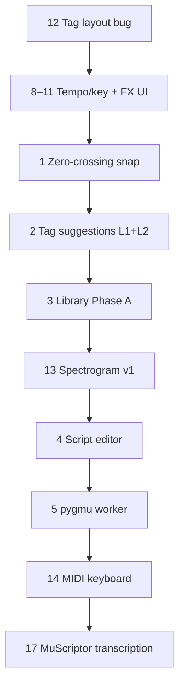

# Butter Classifier — Roadmap

Living backlog of planned work. Phases 1–6 are complete; see [`LUP-ADAPTATION-PLAN.md`](LUP-ADAPTATION-PLAN.md) for shipped history.

Last updated: 2026-07-23 (17 items; #13 Mel STFT v1 shipped)

---

## Priority overview



| Priority | # | Item | Effort |
|----------|---|------|--------|
| Now | 12 | Tag controls alignment bug | ~15 min |
| Next | 8–11 | Tempo/key display + FX coupling + text entry | ~2–3 days |
| Soon | 1 | Zero-crossing snap | ~1–2 days |
| Then | 2 | Tag suggestions (instrument + genre) | ~1 week |
| Medium | 3, 7, 13, 15, 16 | Library feel, add-folder verify, spectrogram, stereo overlay, Get Info | varies |
| Later | 4, 5, 6, 14, 17 | Script editor, pygmu, Tag Zones, MIDI keyboard, audio→MIDI transcription | larger |

---

## 1. Zero-crossing snap

**What:** Snap playhead, onsets, selection edges, and loop points to the nearest zero crossing on commit (not during playback).

**Why:** The editor already has all interaction points (`WaveformView`, loop drag, `addOnset`, selection). The gap is sample-accurate data — `WaveformData` only has min/max display bins.

**Approach:**
1. Add `ZeroCrossingIndex` — decode mono PCM once (or cache alongside waveform load), scan for crossings in a ±2–8 ms window.
2. Expose `snapTime(_:direction:)` that picks nearest crossing; for loops, prefer matching crossing direction at start/end.
3. Hook on **mouseup / commit** in classify mode, trim selection, and seek — not on every playhead tick.
4. Settings toggle + Option bypass.

**Effort:** ~1–2 days. Self-contained, no new dependencies.

---

## 2. Better tag suggestions (instrument + genre)

**What we have:** `TagSuggester` with filename tokens, simple audio heuristics, and Tag Zone scalar matching. Genre is thin; instrument detection beyond kick/snare/top is limited. Analyzer already computes MFCCs, chroma, spectral rolloff, ZCR, swing — but `TagSuggester` doesn't use most of it.

**Approach (layered):**

**Layer 1 — Quick wins**
- Expand `tag-token-rules.json`: `rock`, `hip-hop`, `jazz`, `pop`, `dnb`, `house`, `trap`, etc.
- Parse parent folder names for genre (`…/Techno/Kicks/…`).
- Use existing scalars better: BPM bands, swing → funk/jazz hints, onset density → drums vs pads.

**Layer 2 — Feature profiles**
- Add `InstrumentProfile` scoring in `TagSuggester.fromAudio` (kick, snare, hi-hat, bass, pad, guitar/keys).
- Use MFCC means from YAML as distance-to-reference vectors.
- Genre profiles: tempo + energy + brightness + harmonic/percussive ratio.

**Layer 3 — Analyzer-side classifier** *(if heuristics plateau)*
- Optional Python step: Essentia, PANNs/YAMNet, or sklearn on MFCCs.
- Write `instrument_hints` / `genre_hints` into YAML.
- Swift reads hints with high confidence; filename rules win on conflict.

**Layer 4 — Learn from library**
- When user confirms tags, store feature vector → tag pairs for kNN or co-occurrence boost.

**Recommendation:** Layer 1+2 first — no new ML deps.

---

## 3. Library browser → more LUP-like

**What we have:** `LibraryFinderView` — horizontal glyph strip, sorted by X axis; Y axis only changes bar height. Tag AND-filter, optional tag-zone scrub, ←/→ navigation, preview panel. Functional but feels like a macOS sheet, not LUP's lobby.

**Gaps vs LUP:**

| Gap | Approach |
|-----|----------|
| 1D layout | True **2D crate**: X and Y axes place columns in x/y space (scatter), not just height. |
| Visual density | Darker canvas, tighter columns, less chrome; glyph colors from analysis. |
| Tag filtering | AND vs OR toggle; persistent tag chips. |
| Keyboard | Shift+arrow range select; up/down when 2D layout exists; auto-scroll focused column. |
| Play behavior | Option: play on focus / audition strip without clicking Play. |
| Workflow | Batch tag from Library; "add to selection" back to main browser. |

**Phased plan:**
- **Phase A** (feel): dark theme, column density, play-on-focus, OR tag filter.
- **Phase B** (function): 2D axis layout, 2D keyboard navigation.
- **Phase C** (workflow): multi-select + batch tag/analyze.

---

## 4. Monaco-style PROC script editor

**What:** Syntax highlighting, line numbers, and routine-name awareness in the PROC script tab (today it's a plain `TextEditor`).

**Approach (pragmatic tiers):**

| Tier | What | Tradeoff |
|------|------|----------|
| **A — "Monaco feel"** | `NSTextView` wrapper: monospaced font, line numbers, `#` comments greyed, routine IDs highlighted, invalid routine names underlined | No web deps; 80% of the UX benefit |
| **B — Autocomplete** | Popup from `ProcCatalog` routine IDs + param names when typing | Small addition on top of A |
| **C — Full Monaco** | `WKWebView` + bundled Monaco | True editor, but heavy |

**Recommendation:** Tier A+B.

---

## 5. pygmu / CDP port

**What:** LUP's deeper spectral/granular effects come from pygmu (Python) and CDP. Butter already has Swift approximations but they're not equivalent.

**Approach:**
1. **Audit gap** — compare LUP preset chains against `proc-routines.json`; tag each as "Swift OK", "needs pygmu", or "needs CDP".
2. **Python worker path** — add `proc_worker.py` beside `audio_analyzer.py`; IPC for preview/commit WAV paths.
3. **Swift port path** — only for 2–3 high-value routines where Python latency hurts.
4. **CDP** — likely external binary; only if specific transforms are irreplaceable.

**Recommendation:** Start with audit + Python worker for `spectblur`-class routines; don't attempt full CDP install.

---

## 6. Tag Zones — simplify or remove

**What it does today:**
1. **Library filter scrub** — vertical slider picks tags from depth bands in a preset.
2. **Tag suggestions** — `TagSuggester.fromTagZones` suggests tags when scalars fall inside a zone band.
3. Full **Tag Zones editor** (toolbar → Tag Zones).

**Options:**

| Option | Effect |
|--------|--------|
| Keep, hide scrub | Remove Library "Tag zone scrub" toggle; keep editor for power users |
| Fold into Library | Drop separate Tag Zones window; use axis pickers + tag chips only |
| Remove entirely | Delete zone-based suggestions; rely on filename + improved audio classifier |

**Recommendation:** Don't invest more until tag suggestions improve (#2). If audio classification gets good enough, zones become redundant.

---

## 7. Add folder UX *(may be done — verify)*

**What:** Two-button folder picker ("Add to Library" vs "Add and Scan"), plus analyzer/scan progress in the bottom status bar (not buried above the file table).

**Status:** Implemented 2026-07-11 (`AddFolderPanel.swift`, bottom status bar in `ContentView`). Verify in a fresh run.

---

## 8–11. Tempo, key, and playback FX coupling

Grouped workstream — items 8–11 belong together.

### 8. Display native tempo & key

**Current state:** BPM from analysis (`sample.bpm`); key is manual-only (`editKeyOverride`). Analyzer doesn't emit detected key yet, though chroma is computed.

**Approach:**
- Show BPM and Key in detail header always (when analyzed).
- Add `key_est` to `audio_analyzer.py` (dominant pitch class from chroma_cens → e.g. `"Am"`, `"F#"`).
- Store on `SampleFile` like BPM.

### 9. Preview adjusted tempo/key from speed & pitch

Live computed values next to native when FX ≠ 1×:
- `effective BPM = nativeBpm × playbackRate`
- `effective Key = transpose(nativeKey, semitones(log₂(pitch) × 12))`
- Display as `128 → 192 BPM` or `Am → Cm`

### 10. Bidirectional tempo/key override ↔ speed/pitch

Editable target fields; on commit, back-solve:
- `speed = targetBpm / nativeBpm`
- `pitch = 2^((targetSemitones − nativeSemitones) / 12)`
- When linked (🔗), adjust both for tape-style shifts.

### 11. Text entry for speed & pitch

**Current state:** `PlaybackSpeedSlider` only — read-only `1.5×` label beside each slider.

**Approach:** Replace label with small `TextField`. Parse `"1.5"`, `"1.5×"`, `"150%"` → clamp 0.25–4×. Keep Option-click on slider handle to reset.

**Key files:** `DetailPane.swift`, `PlaybackSpeedSlider.swift`, `AudioPlayer.swift`, `audio_analyzer.py`, `Models.swift`.

---

## 12. Tag controls alignment bug

**Symptom:** When a file has no tags, the "add tags" field and Add/Pick/Suggest buttons appear on the left. With tags present, they appear on the right. They should always stay on the right.

**Root cause:** In `SampleTagsEditor`, tags and controls share one `HStack`. When `FlowLayout` has no tag chips, controls sit at the leading edge.

**Fix:** Split the row — tags in a leading `FlowLayout`, controls in a trailing group pinned right:

```swift
HStack(alignment: .top, spacing: 8) {
    FlowLayout { /* tag chips */ }
    Spacer(minLength: 8)
    HStack { /* add field + Add/Pick/Suggest — always trailing */ }
}
```

**File:** `TagPickerSheet.swift` (`SampleTagsEditor`).

---

## 13. Spectrogram waveform mode

**Status:** Mel STFT v1 shipped 2026-07-23 (`STFTSpectrogram`, `.stf` cache). Resonate (François ICMC 2025) mothballed in `ResonateSpectrogram.swift` for reference. Remaining: settings panel + LOD controls.

**What:** `WaveformMode.spectrogram` with a settings panel similar to LUP's spectrogram settings.

**Shipped defaults:**

| Setting | Value |
|---------|---------|
| Type | Regular STFT (Accelerate) |
| FFT size | 2048 |
| Window | Blackman |
| Time overlap | 4× (hop 512; 1024 above 90 s) |
| Frequency scale | Mel (96 bands) |
| Color map | Per waveform theme |
| Amplitude range | −80 … 0 dB (peak-relative) |
| Cache | `.stf` sidecar next to sample |

**Still todo:**
1. `SpectrogramSettings` struct (UserDefaults-backed, like waveform themes).
2. Settings sheet (gear menu on mode picker).
3. LOD: decimate bins/time for files > 90 s unless high-quality is forced; cache size cap.
4. Optional: absolute dB floor (−120), window/FFT pickers.

---

## 14. MIDI integration

**What:** Control sample playback and workflow via MIDI keyboard or controller.

### Core playback control (v0)

- **Note-on triggers play** — map MIDI notes to currently selected sample (or audition pad bank)
- **Note-off behavior** — stop on release, one-shot, or gate while held (configurable)
- **Velocity → volume** — map note velocity to playback gain
- **Pitch bend / key follow** — transpose playback by semitones from a base note (synergy with #8–11)
- **Sustain pedal (CC64)** — hold samples or latch loop playback

### Sample triggering modes

| Mode | Behavior |
|------|----------|
| One-shot | Each note-on plays from start (or cursor) |
| Retrigger | Restarts on every note-on while playing |
| Choke group | New note stops the previous (drum one-shots) |
| Round-robin | Cycle through selected files on repeated hits |
| Multi-sample map | Spread selected files across a keyboard range |

### Navigation & workflow

- **MIDI → file list** — program change or note range selects next/previous sample
- **MIDI → Library browser** — trigger audition from glyph canvas via mapped notes
- **MIDI learn** — click a control, press a MIDI message, store the binding
- **MPC-style pads** — assign recent / favorited / tagged samples to a 4×4 grid

### Transport & editor control

- **Play/pause/stop** — dedicated CC or note mappings
- **Seek/scrub** — encoder or pitch wheel mapped to playhead position
- **Loop brace nudge** — CC adjusts loop in/out while classify mode is on
- **Tag confirm/dismiss** — map "apply suggestion" / "next file" to buttons or footswitches

### Tempo & FX coupling

- **Clock sync** — receive MIDI clock to lock playback rate to external tempo
- **MIDI CC → speed/pitch** — real-time FX control from knobs
- **Note → target key** — play a note to set pitch-shift target (bidirectional key override)

### Technical approaches on macOS

| Approach | Pros | Cons |
|----------|------|------|
| Core MIDI | Native, low latency, no deps | More boilerplate |
| AVFoundation MIDI | Fits existing `AudioPlayer` / `AVAudioEngine` stack | Less flexible for hot-plug |
| Virtual MIDI port | Other apps can send notes to Butter | Needs IAC driver for some users |

### Architecture sketch

```
MIDIInputManager
  ├── device enumeration + hot-plug
  ├── MIDILearnStore (UserDefaults / JSON)
  └── route messages → MIDIAction enum

MIDIAction → AudioPlayer / SampleListNavigation / DetailPane
  ├── .triggerPlay(note, velocity)
  ├── .stop
  ├── .selectSample(index)
  ├── .setPlaybackRate(ccValue)
  └── .nudgeLoop(delta)
```

### Settings UI

- Input device picker (multi-device)
- Channel filter (1–16, omni)
- Base note / octave for sample mapping
- Velocity curve
- "MIDI enabled" master toggle (off by default)
- Learn mode indicator in status bar

### Phased rollout

1. **v0** — note-on plays/stops current sample, velocity → volume
2. **v1** — MIDI learn for play/stop/next/prev; base-note transpose
3. **v2** — multi-sample keyboard map, choke groups, pad mode
4. **v3** — clock sync, CC → FX, Library audition via MIDI

**Depends on:** Solid playback UX (#8–11) before advanced MIDI/FX coupling.

**Note:** This is MIDI *input* (keyboard/controller → Butter). For audio → MIDI *transcription*, see **#17**.

---

## 17. Audio → MIDI transcription (MuScriptor)

**What:** Transcribe a sample's audio into multi-instrument MIDI using [MuScriptor](https://github.com/muscriptor/muscriptor) — note onsets/offsets with instrument group labels, written as a sidecar next to the WAV.

**Why:** Enables melody/harmony inspection, MIDI export, and (later) instrument-aware tag suggestions. Complements analysis YAML (BPM, onsets, MFCCs) with full polyphonic pitch content.

**Reference docs:**
- [`MUSCRIPTOR-REFERENCE.md`](MUSCRIPTOR-REFERENCE.md) — API, models, instrument groups, local fork
- [`MUSCRIPTOR-INTEGRATION-PLAN.md`](MUSCRIPTOR-INTEGRATION-PLAN.md) — phased rollout, sidecar design
- Validated decoder fixes: `../midi classifier` branch `local/butter-reference`

**Not the same as #14:** #14 is MIDI keyboard control of playback; #17 is machine transcription of audio content.

### Phased rollout

| Phase | Scope |
|-------|--------|
| **A** | Batch transcribe → `sample.wav.mid` sidecar; subprocess or worker |
| **A′** | Standalone `MidiPreviewPlayer` — audition MIDI in-app; `AudioPlayer` unchanged; no WAV/MIDI sync |
| **B** | Persistent `TranscriptionRunner` (mirror `AnalyzerRunner`) |
| **C** | Structured `notes.yaml` + in-app piano roll (unsynced playhead OK) |
| **C′** | Synced WAV+MIDI compare (`TranscriptionPreviewEngine`); mix, stereo A/B |
| **D** | Tag ↔ instrument conditioning bidirectional |

### Sidecar

| File | Owner | Purpose |
|------|-------|---------|
| `sample.wav.mid` | Transcription worker | Standard MIDI export |
| `sample.wav_notes.yaml` *(optional)* | Transcription worker | Note events for native UI |

### Must carry from local spike

Decoder patches in `muscriptor/events.py` — without them, first notes at 5 s chunk boundaries and tie-prologue openings are dropped. See [`LOCAL-PATCHES.md`](../midi%20classifier/docs/LOCAL-PATCHES.md).

### Packaging notes

- Model weights: HuggingFace gated, CC BY-NC 4.0
- `small` variant realistic for CPU app bundle; larger variants optional download
- PyTorch + muscriptor add significant bundle size

**Effort:** Phase A ~3–5 days; Phase A′ ~2–4 days on top of A; full Phase C ~2–3 weeks; Phase C′ ~1 week on top of A′ + C.

**Depends on:** Stable analyze/playback UX (#8–11) recommended before heavy ML jobs in-app.

---

## 15. Stereo overlay waveform mode

**What:** A waveform view that draws **L** and **R** on the same canvas as semi-transparent fills in two distinct colors. Where both channels overlap (mono or correlated signal), the colors blend into a third mixed hue. Where one channel dominates, that channel's color shows through — making stereo width, hard-panned content, and phase issues visible at a glance.

**Visual model:**

| Signal | What you see |
|--------|--------------|
| Mono / identical L+R | Uniform blended color (color₁ + color₂ at ~50% opacity each) |
| Hard left | Mostly color₁ (L) |
| Hard right | Mostly color₂ (R) |
| Out-of-phase / wide stereo | Alternating or mottled L/R colors within a bin |
| Silence | Background only |

**Current state:** `WaveformLoader` downmixes all channels to mono before binning (`WaveformData` is a single min/max pair per bin). `WaveformCanvas.drawClassicWaveform` draws one envelope. Peak meters already expose separate L/R levels in `AudioPlayer` / `PeakMeterView`.

**Approach:**

1. **Per-channel waveform data**
   - Extend cache format (`.wfc` / `.wfx`) or add `.wfc2` with `{ left: WaveformData, right: WaveformData }`.
   - `WaveformLoader.loadStereo(url:)` — bin L and R independently (reuse existing `bin()` logic per channel; for mono files, duplicate L into R or draw single channel centered).
   - `WaveformCache` loads/stores stereo pairs alongside existing mono caches.

2. **New mode**
   - Add `WaveformMode.stereoOverlay` (label: "Stereo" or "L/R") to the mode picker alongside Original, Supersample, Glass, etc.
   - `WaveformRenderModel` gains optional `leftWaveform` / `rightWaveform` (or `stereo: StereoWaveformData?`).

3. **Drawing**
   - In `WaveformCanvas`, draw R envelope first, then L (or vice versa) with `.color(leftColor.opacity(0.45))` and `.color(rightColor.opacity(0.45))`.
   - Use **source-over compositing** so overlap naturally produces the blend.
   - Optional thin stroke on top for readability at high zoom (reuse theme stroke colors).

4. **Colors**
   - Default pair: e.g. cyan (L) + magenta (R) → white-ish blend when mono; or theme-derived L/R from `WaveformColorTheme` (add `stereoLeft` / `stereoRight` to `ResolvedWaveformTheme`).
   - Respect existing theme picker; Snapper-style themes could use accent + complement.

5. **Interaction**
   - All existing editor interactions unchanged (playhead, selection, loop, onsets use time axis only — same bin count as mono).
   - Mono files: both envelopes identical → uniform blend (validates the "mono = blended color" expectation).

6. **Performance**
   - Same bin count as classic waveform; only draw cost is 2× fill passes. `.drawingGroup()` cache already used in `WaveformCanvas`.
   - No analysis YAML required — works on any file, like Original/Supersample.

**Effort:** ~1–2 days. Mostly loader/cache extension + one new draw path. Natural companion to #13 (spectrogram) as another waveform display mode.

**Key files:** `WaveformLoader.swift`, `WaveformData.swift` (or new `StereoWaveformData`), `WaveformCache.swift`, `WaveformMode.swift`, `WaveformCanvas.swift`, `WaveformColorTheme.swift`.

---

## 16. Get Info — sample metadata inspector *(view + edit)*

**What:** A **Get Info** command (⌘I or context menu) that opens a popup/sheet showing deep sample metadata from all sidecars and the SwiftData cache — organized in a **database-style grid** (key / value / type / source) for easy scanning, sorting, and drill-down. **Editable rows** write back to the appropriate sidecar; read-only rows (analysis machine output) are clearly marked.

**Data sources to surface:**

| Source | File | Examples | Editable? |
|--------|------|----------|-----------|
| Analysis | `sample.wav.yaml` | `duration`, `sample_rate`, `bpm_est`, `kickiness`, `pitch_salience`, `integrated_loudness_ebur128`, swing stats, `mfcc`, `chroma`, `rms`, `onset_times`, `onset_infos`, … | **Read-only** (re-analyze overwrites) |
| Edits | `sample.wav_edits.yaml` | `onset_times`, `loop_start`, `loop_end`, `bpm_override`, `key` | **Yes** |
| Tags | `sample.wav_tags.yaml` | `tags`, `suggested` (tag, confidence, source) | **Yes** (tags; dismiss/apply suggestions) |
| App cache | SwiftData `SampleFile` | Indexed scalars, `isAnalyzed`, `yamlModifiedAt`, library glyphs, path/folder | Derived (refreshed on save) |
| File system | Audio file | Size, modified date, format (via `AVAudioFile`) | Read-only |

Much of the analysis YAML is **not** loaded into Swift today (`AnalysisResult` only parses a subset for waveform/tagging). Get Info is the right place to expose the full dump without bloating the main UI — and to edit user-owned fields without opening Classify mode or the tag row.

**UI concept:**

```
┌─ Get Info: kick_808.wav ─────────────────────────────┐
│ [Summary] [Analysis] [Edits] [Tags] [Raw YAML]      │
├──────────────────────────────────────────────────────┤
│ 🔍 Filter…                          Sort: Key ▼     │
├──────────────┬─────────────────┬──────┬─────────────┤
│ Key          │ Value           │ Type │ Source      │
├──────────────┼─────────────────┼──────┼─────────────┤
│ bpm_est      │ 128.0           │ f64  │ analysis 🔒 │
│ kickiness    │ 72.4            │ f64  │ analysis 🔒 │
│ bpm_override │ [128.0]         │ f64  │ edits    ✎  │
│ key          │ [Am]            │ str  │ edits    ✎  │
│ loop_start   │ [0.120]         │ f64  │ edits    ✎  │
│ onset_times  │ [24 items]      │ arr  │ edits    ✎▸ │
│ tags         │ snare, 808      │ list │ tags     ✎  │
└──────────────┴─────────────────┴──────┴─────────────┘
│ Unsaved changes · Revert · Apply  ·  Copy  ·  ⌘S   │
└──────────────────────────────────────────────────────┘
```

**Approach:**

1. **Generic YAML tree flattening**
   - `SampleInfoModel` loads raw YAML via Yams into `[InfoRow]` with path notation (`mfcc[3][7]`, `onset_infos[2].bands`).
   - Row types: scalar, array (collapsible summary + count), nested object (drill-in or expandable tree).
   - Each row carries `isEditable`, `writeTarget` (`.edits`, `.tags`, `.none`).
   - Tag rows from `TagSidecar.Document`; edits from `EditSidecar`; merge with `SampleFile` cached fields (mark source column).

2. **Grid view**
   - SwiftUI `Table` or `OutlineGroup` for macOS-native feel — sortable columns (Key, Value, Type, Source).
   - Search/filter bar across keys and values.
   - **Inline edit:** double-click or ✎ on editable scalars → `TextField` / stepper; commit on Return or blur.
   - **Array editor:** drill-in pane for `onset_times` (add/remove/reorder rows), `tags` (chip list + add field), loop pair (start/end with validation).
   - Click read-only array → expansion + sparkline only (no edit).
   - Lock icon 🔒 on analysis rows; pencil ✎ on user-owned rows.

3. **Tabs / sections**
   - **Summary** — headline metrics; quick-edit BPM/key/tags when editable overrides exist.
   - **Analysis / Edits / Tags** — filtered views by source; Edits and Tags tabs default to edit-friendly layout.
   - **Raw YAML** — split pane: left = sidecar picker, right = monospaced text; **live sync** from grid edits for edits/tags sidecars; analysis tab read-only with "Re-analyze" button.

4. **Write path & sync**
   - Edits tab changes → `EditSidecar.save` → `LibraryScanner` refresh indexed fields (`editBpmOverride`, `editOnsetTimes`, etc.) → notify `DetailPane` / waveform to reload onsets & loop.
   - Tags tab changes → `TagSidecar.save` / `LibraryScanner.saveTags` → refresh catalog counts.
   - Suggested tags: apply (+) or dismiss (×) inline; same as main tag row.
   - **Apply / Revert** bar when dirty; ⌘S saves all pending sidecar writes.
   - Reuse existing validation (loop end > start, BPM > 0, key non-empty trim).

5. **What not to edit here (v1)**
   - Analysis YAML scalars/arrays — owned by analyzer; editing would be overwritten on re-analyze. Show with tooltip: "Re-analyze to refresh."
   - Optional later: "Promote to override" — copy `bpm_est` → `bpm_override` with one click (bridges analysis → edits without manual retype).

6. **Entry points**
   - Detail pane toolbar button (ⓘ) next to Reveal in Finder.
   - Context menu on file table row: "Get Info".
   - Keyboard shortcut ⌘I when a sample is selected.
   - Works with multi-select: show info for focused file; bulk-edit **tags only** in v2 (same tags applied to all selected).

7. **Stale / missing indicators**
   - Flag when `yamlModifiedAt` ≠ sidecar mtime, or file modified since last analyze.
   - Grey out analysis tab when `isAnalyzed == false` with "Analyze to populate" CTA.
   - Warn if edits conflict with open Classify session on same file (reload or block Apply).

8. **Performance**
   - Lazy-load full YAML on sheet open (don't parse 40+ array fields on every row select).
   - Cache parsed `SampleInfoModel` keyed by path + sidecar mtime; invalidate on Apply.
   - Cap inline array preview (first 256 elements) with "show all" for huge chroma/MFCC frames.

**Effort:** ~3–4 days (view + flattener + editable grid + sidecar write-back + DetailPane sync).

**Key files:** new `SampleInfoSheet.swift`, `SampleInfoModel.swift`, `YAMLValues.swift`, `EditSidecar.swift`, `TagSidecar.swift`, `LibraryScanner.swift`, `AnalysisResult.swift`, `DetailPane.swift`, `SampleFileTableView.swift`.

**Future extensions:**
- Copy row / copy section as YAML or JSON
- Diff view (analysis vs edits for onsets/BPM/key)
- "Promote to override" from analysis → edits
- Bulk tag edit for multi-select
- Export info report for selected files

---

## Still deferred (not on active backlog)

From original plan — larger bets, not prioritized:

- AU plugin chain
- Live collaborative rooms
- PUBS tab
- Full Monaco / WKWebView script editor (see #4 Tier C)
- Chroma pitch labels (C, C#, D… on chromagram Y axis)
- Glass/chroma tuning — per-theme contrast slider
- File list auto-scroll verification after shift+multi-select fix

---

## Suggested implementation order

1. **#12** Tag layout bug
2. **#8–11** Tempo/key + FX UI
3. **#1** Zero-crossing snap
4. **#2** Tag suggestions L1+L2
5. **#3** Library Phase A
6. **#13** Spectrogram v1
7. **#15** Stereo overlay waveform
8. **#16** Get Info metadata inspector
9. **#4** Script editor Tier A+B
10. **#5** pygmu audit + worker
11. **#6** Tag Zones decision (after #2)
12. **#14** MIDI keyboard v0 → v3
13. **#17** MuScriptor transcription Phase A → D (see integration plan)
14. **#7** Verify add-folder UX
